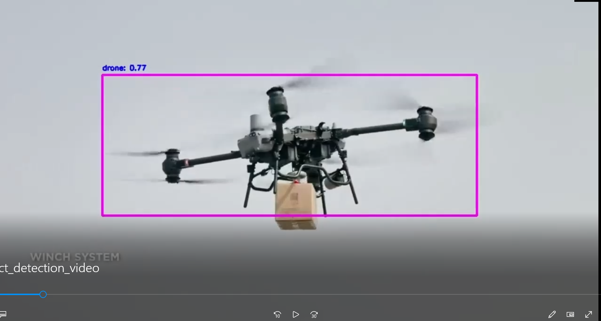

# YouTube Object Detection with YOLOv8 🦅🛸

Real-time bird and drone identification using YOLOv8.

[

## Functionality Overview

- **Libraries:** OpenCV (cv2), ultralytics, math, pytube.
- **Model Path:** Replace with your YOLOv8 model weights file.
- **YOLOv8 Classes:** "bird", "drone", etc.
- **YouTube Video URL:** Paste URL for analysis.
- **Video Stream URL:** pytube 🪄.
- **Webcam Integration:** Analyze videos with webcam as a live feed.
- **Continuous Loop:**
    - Capture, validate frames.
    - YOLOv8 object detection.
    - Draw bounding boxes, display class names and confidence.
- **Display:** Present video with highlighted objects ✨.
- **User Input:** Exit loop with 'q' key.
- **Release Resources:** Properly close windows and release capture.

## Usage Instructions

1. **Install Libraries:** `pip install opencv-python ultralytics pytube`.
2. **Replace Model Path:** Point to your YOLOv8 model weights file.
3. **Replace Video URL:** Uncomment `video_url` and paste YouTube video URL ➡️ [link to YouTube video](https://www.youtube.com/).
4. **Run Script:** Execute `python object_detection.py`.

## See the Demo Video

**Option 1: Direct Link:**

[Watch the Demo Video](object_detection_videos/object_detection_videos.mp4) ️

**Option 2: Video Hosting Platform:**

<iframe width="560" height="315" src="VIDEO_URL" frameborder="0" allow="autoplay; fullscreen; picture-in-picture" allowfullscreen></iframe>

**Replace `VIDEO_URL` with your actual video player URL (e.g., YouTube, Vimeo).**

## Potential Enhancements

- Support multiple video formats.
- Adjust confidence threshold for bounding boxes display ️.
- Integrate distance estimation or other calculations.
- Allow users to specify a region of interest (ROI) for focused detection.
- Implement a user interface for interactive control  ️.

We welcome contributions to this project! Feel free to fork the repository, make your changes, and submit a pull request .

